# 19. 初期试点方案与后续推广方案

版本：v1.1

场景：10 万人级别大厂内，一个约 10 人研发小组先行推广团队 AI 开发范式。

目标：先用低成本、可衡量的 4 周对比实验，解决“AI 代码质量不稳定、review 负担变大、团队用法五花八门”的现实问题；如果试点有效，再逐步升级到团队级、部门级、企业级治理体系。

## 1. 给上级的一句话

```text
我们不申请先建设一套大平台，而是申请做一个 4 周小组试点：
用 PR 模板、AI Review Checklist 和 3 条团队 Memory，
验证是否能降低 AI 代码带来的 review 负担和重复问题。
试点有效后，再讨论是否引入轻量 Hook、Trace 或更完整的治理能力。
```

## 2. 当前问题

当前小组已经有 `AGENTS.md` 或类似规范，但没有形成完整的 Memory、Hook 和 Trace。

上级主要痛点是：

1. **AI 代码质量不稳定**
   - reviewer 需要反复指出逻辑缺陷、测试缺口、范围失控。
   - AI 产出经常“表面可运行，但细节不稳”。

2. **团队 AI 用法五花八门**
   - 不知道哪些 PR 使用了 AI。
   - 不知道 AI 用在设计、代码、测试还是文档。
   - review 时缺少统一检查口径。

3. **review 负担增加**
   - reviewer 不只看代码，还要猜 AI 有没有漏边界、有没有改无关文件、有没有过度抽象。

## 3. 总体策略

不直接推完整企业级蓝图，先做小实验。

试点期间采集的数据只用于改进流程和判断是否继续，不用于个人排名、绩效扣分或惩罚。

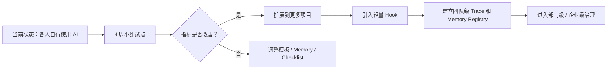

## 4. 初期方案：4 周对比实验

### 4.1 实验定义

```text
实验对象：约 10 人研发小组
实验周期：4 周
对照方式：规范前 AI PR vs 规范后 AI PR
样本来源：过去 2 周 5-15 个 PR 作为 baseline；未来 4 周 PR 作为 experiment
采集方式：每周最多抽样 5-10 个 AI PR；如果当周不足 5 个，则全量分类 review comment
补充口径：记录 PR 大小和变更类型，避免把大 PR 的天然复杂度误判为 AI 质量问题
```

### 4.2 实验目标

| 目标 | 说明 |
|---|---|
| AI 使用可见 | 每个 PR 标注是否使用 AI，以及 AI 用在哪些环节 |
| review 更有抓手 | reviewer 用 5 条 checklist 检查 AI 常见问题 |
| 重复问题减少 | 把最常见 3 类问题写成 Memory，让 AI 和 reviewer 都引用 |
| 形成可汇报证据 | 4 周后用 before / after 数据向上级汇报 |

## 5. 初期干预措施

Phase 1 只做三件事。

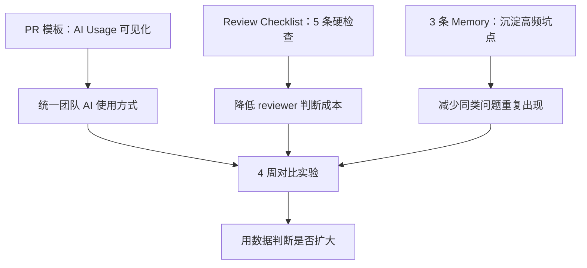

### 5.1 PR 模板增加 AI Usage

```md
## AI Usage
- [ ] Used AI
- [ ] Did not use AI

If used:
- Tool / Agent:
- Used for:
  - [ ] Design
  - [ ] Code
  - [ ] Test
  - [ ] Review
  - [ ] Docs

## AI Notes
- AI 主要做了什么：
- 我人工重点检查了什么：
```

设计原则：

- 不要求长篇解释。
- 先让 AI 是否参与变成可见事实。
- 对几乎所有 PR 都使用 AI 的团队，重点不是区分 AI / 非 AI，而是规范 AI 使用。

### 5.2 Review Checklist 只保留 5 条

```md
## AI Review Checklist

- [ ] 是否改了需求范围外的文件？
- [ ] 核心路径是否有测试？
- [ ] 异常路径 / 边界条件是否有测试或说明？
- [ ] 是否影响已有接口、数据结构或配置？
- [ ] 是否触碰红区、敏感数据、新依赖或权限配置？
```

设计原则：

- 不追求完整，只抓高频问题。
- 不增加 reviewer 过多负担。
- 每条都能直接对应 AI 代码质量或风险问题。

### 5.3 首批只放 3 条 Memory

建议优先从 baseline PR 中提炼最高频的 3 类问题。若暂时没有足够样本，再使用以下通用三条：

```text
MEM-PITFALL-001：AI 变更必须说明是否修改需求范围外文件。
MEM-PITFALL-002：AI 变更必须覆盖核心路径和异常路径测试，无法测试时必须说明原因。
MEM-PITFALL-003：AI 变更必须说明是否影响已有接口、数据结构或配置。
```

Memory 不是知识库堆积，而是用于减少重复 review 的团队共识。

## 6. 实验指标

不追求复杂指标。第一期只看 3 个主指标和 2 个辅助指标。

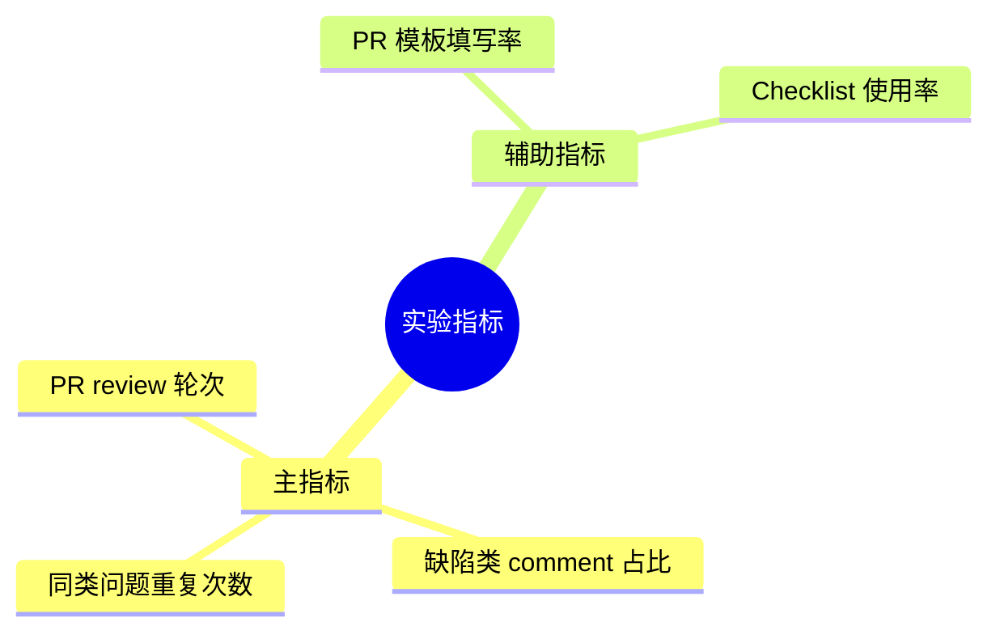

### 6.1 主指标 1：PR Review 轮次

定义：

```text
一个 PR 从打开到合并，经历了几轮 review comment -> fix -> re-review。
```

意义：

- review 轮次越高，说明 reviewer 需要反复指出问题。
- 如果规范有效，review 轮次应下降或稳定。

### 6.2 主指标 2：缺陷类 Comment 占比

把 review comment 分成 5 类：

| 分类 | 说明 |
|---|---|
| 逻辑缺陷 | 代码行为不对、边界漏了 |
| 测试缺口 | 没测核心路径或异常路径 |
| 范围失控 | 改了不该改的文件或做了无关重构 |
| 可维护性 | 命名、结构、复杂度、过度抽象 |
| 表层问题 | 格式、文案、注释、小调整 |

重点看前三类是否下降：

```text
逻辑缺陷 + 测试缺口 + 范围失控
```

### 6.3 主指标 3：同类问题重复出现次数

定义：

```text
同一类 AI 犯错模式在观察期内重复出现的次数。
```

意义：

- 如果 Memory 有效，同类问题应该逐步减少。
- 如果同类问题仍重复出现，说明 Memory 没被使用，或 checklist 没有抓住真正痛点。

### 6.4 指标采集方式

由你每周集中抽样分类，不要求每个 reviewer 填表。每周最多抽样 5-10 个；如果当周不足 5 个，则全量分类。

记录时只保留必要字段：PR、是否使用 AI、变更规模、review 轮次、comment 分类和典型样例。不要求保存完整 prompt。

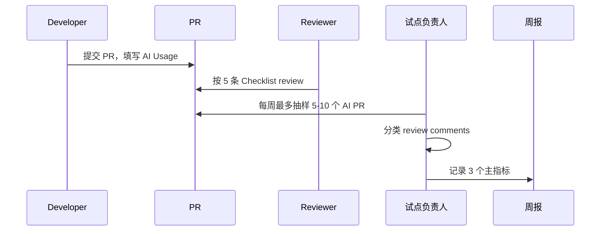

## 7. 4 周执行计划

下图日期是示例，请按实际启动日替换；对外汇报时建议保留 Week 0-4 表述，避免日期过期。

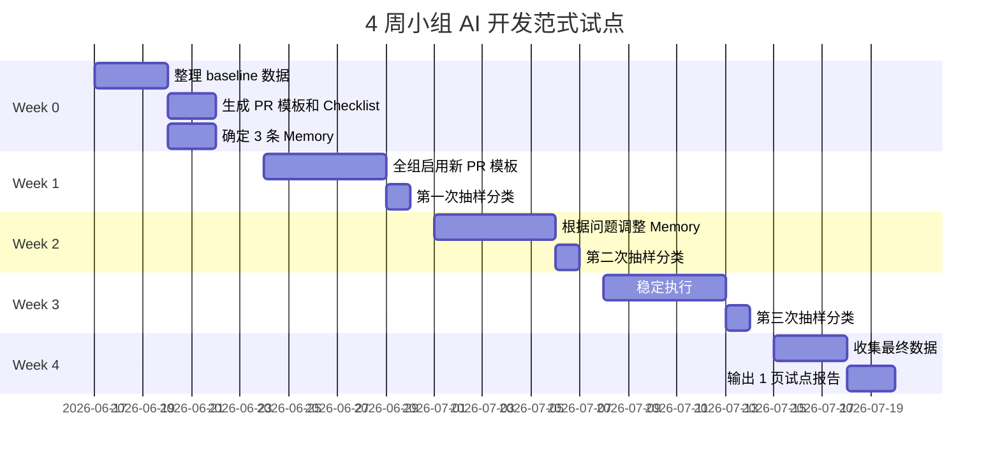

可根据真实日期调整。这里的重点是节奏，不是具体日期。

## 8. 小组内执行分工

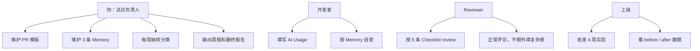

## 9. 成功判定

4 周后，不要求所有指标都明显改善。建议用“继续 / 调整 / 停止”三档判断。

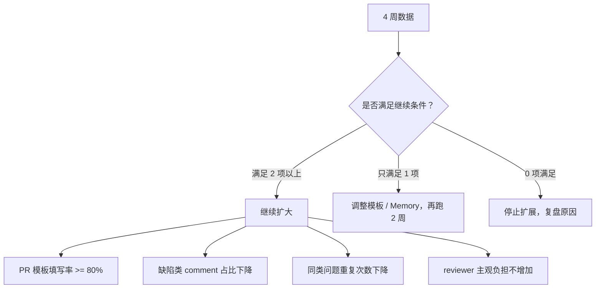

建议继续条件：

- PR 模板填写率 ≥ 80%。
- 缺陷类 comment 占比下降。
- 同类问题重复次数下降。
- reviewer 主观反馈不变差。

## 10. 给上级看的试点汇报结构

最终只需要 1 页。

```text
1. 我们解决的问题
   AI 代码质量不稳定，review 负担变大，用法不统一。

2. 我们做了什么
   PR 模板 + 5 条 AI Review Checklist + 3 条 Memory。

3. 数据对比
   before / after 三个指标。

4. 发现
   哪些问题减少，哪些仍然存在。

5. 下一步申请
   如果有效，申请扩展到更多项目或引入轻量 Hook。
```

## 11. 后续方案总览

整体按 5 个阶段推进，其中 Phase 1 是当前 4 周试点，Phase 2-5 是试点有效后的后续扩展。

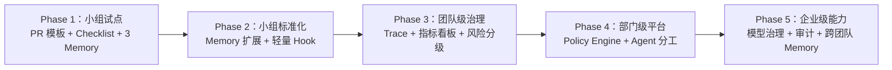

## 11.1 Roadmap Map：按时间段理解整个推进路径

这套方案不要被理解成“一次性建设完整平台”。它更像一张分阶段地图：先用 1 个月证明问题和方法成立，再用约 2 个月形成小组标准，随后逐步进入平台化和企业级治理。

图表兼容性说明：下方 `timeline` 和 `xychart-beta` 属于增强 Mermaid 图。如果阅读环境不支持渲染，以“阶段地图表”和“管理层决策点”流程图为准。

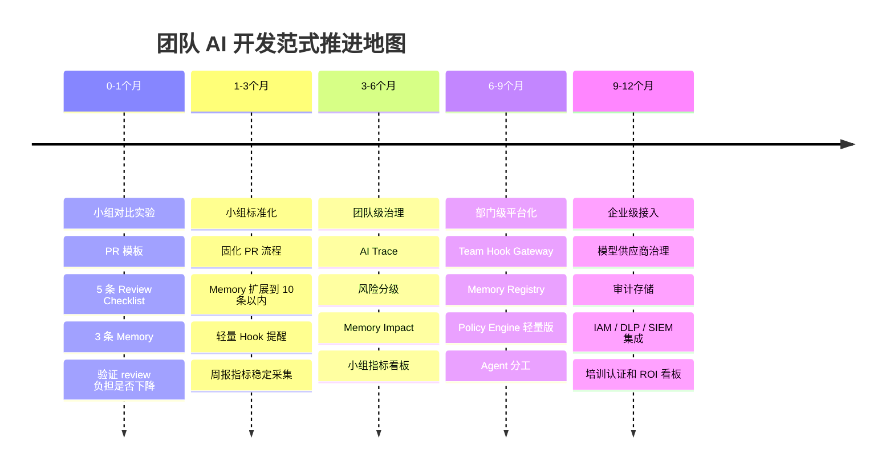

### 阶段地图表

| 时期 | 阶段名称 | 核心问题 | 主要动作 | 关键产出 | 资源诉求 |
|---|---|---|---|---|---|
| 0-1 个月 | 小组对比实验 | AI 质量不稳、review 负担大、用法不可见 | PR 模板、5 条 checklist、3 条 Memory、每周抽样分类 | 1 页试点报告、before/after 数据 | 只需要上级认可试点，不申请平台资源 |
| 1-3 个月 | 小组标准化 | 试点有效后如何变成日常习惯 | 固化 PR 模板、Memory Review、轻量 Hook、周报指标 | 小组 AI 开发规范 v1、10 条以内 Memory | 少量工程时间，可能需要 CI/PR 模板支持 |
| 3-6 个月 | 团队级治理 | 如何让 AI 参与可追踪、可复盘 | AI Trace、风险分级、Memory Impact、指标看板 | 小组治理看板、风险分级规则、Trace 记录 | 需要技术负责人支持，可能需要轻量脚本 |
| 6-9 个月 | 部门级平台化 | 多项目如何复用和治理 | Hook Gateway、Memory Registry、Policy Engine 轻量版、Agent 分工 | 部门级 AI 开发治理原型 | 需要平台/效能资源投入 |
| 9-12 个月 | 企业级接入 | 如何满足安全、合规、审计和跨团队推广 | 模型治理、审计存储、IAM/DLP/SIEM 接入、培训认证、ROI 看板 | 企业级 AI 开发治理方案 | 需要安全、法务、平台、管理层共同参与 |

### 一句话解释每个时期

```text
0-1 个月：证明这件事值得做。
1-3 个月：让小组真的用起来。
3-6 个月：让使用过程可追踪、可度量。
6-9 个月：把小组经验平台化，支持更多项目。
9-12 个月：接入企业治理体系，变成可扩展能力。
```

### 资源投入曲线

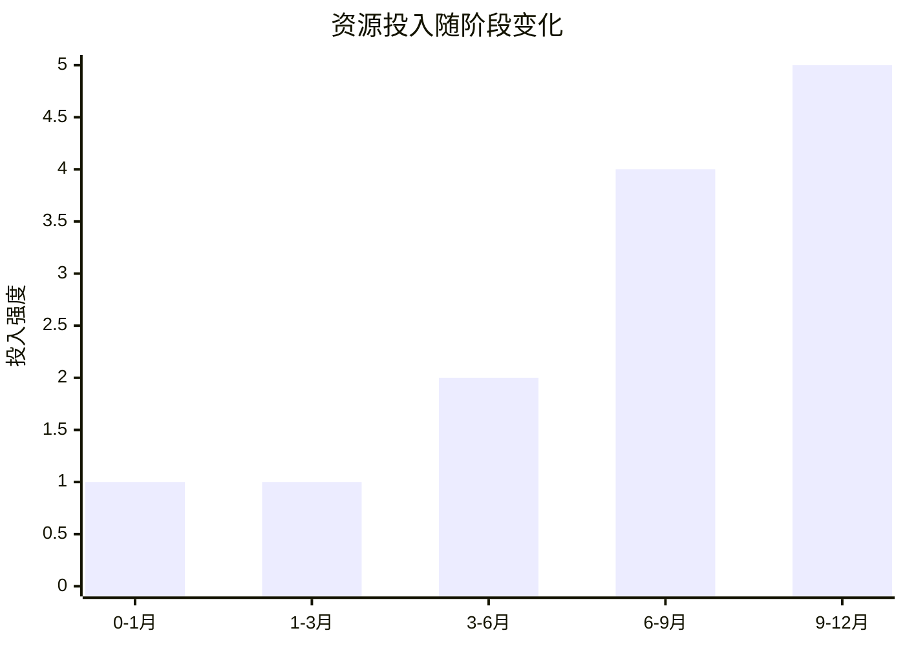

### 价值证明曲线

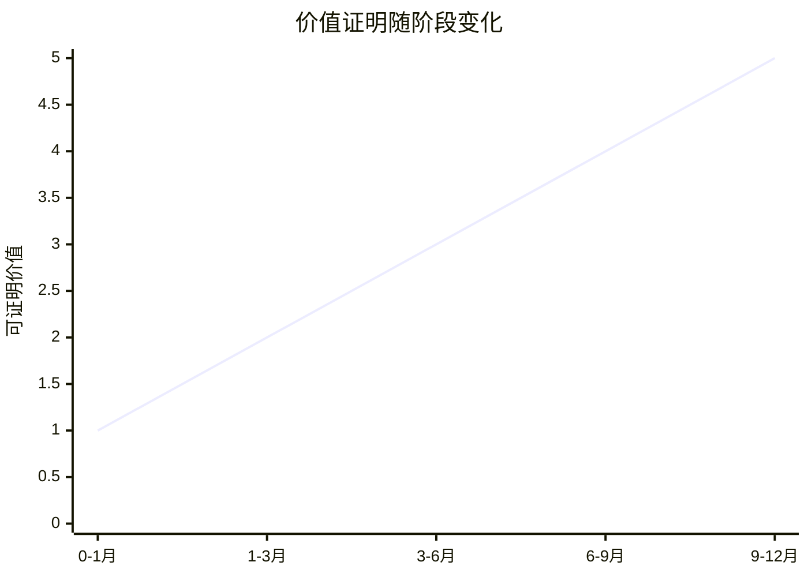

### 管理层决策点

每个阶段结束都应该有一个明确决策，而不是自然滑向下一阶段。

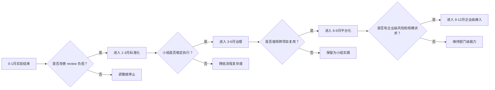

## 12. Phase 2：小组标准化

时间：第 2-3 个月。

目标：

- 让试点动作变成小组默认流程。
- 把 3 条 Memory 扩展到 10 条以内。
- 引入最小 Hook，但不做平台建设。

动作：

| 动作 | 说明 |
|---|---|
| 固化 PR 模板 | 所有 PR 默认填写 AI Usage |
| Memory Review | 每两周更新一次 Memory |
| 轻量 Hook | 检查 PR 是否填写 AI Usage、是否触碰高风险目录 |
| 周报指标 | 继续跟踪 review 轮次和缺陷类 comment |

图示：

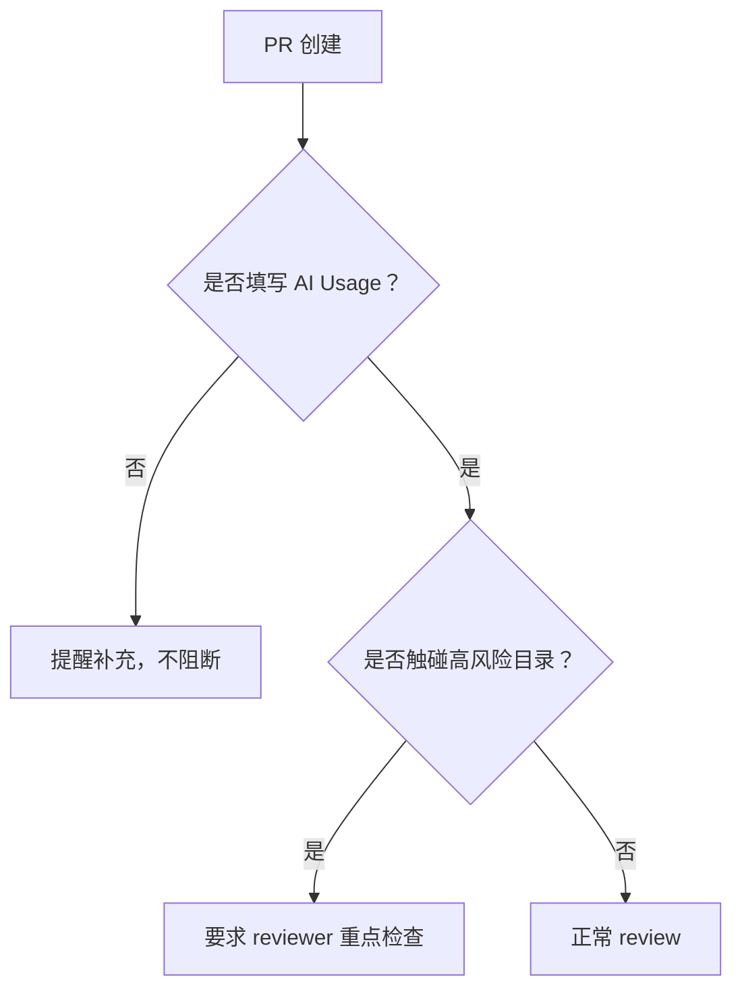

## 13. Phase 3：团队级治理

时间：第 3-6 个月。

目标：

- 从“模板化”升级到“可追踪”。
- 建立 AI Trace 和基础指标看板。
- 对高风险变更建立明确审批。

动作：

| 能力 | 说明 |
|---|---|
| AI Trace | 每个 AI PR 有 trace_id 或等价记录 |
| 风险分级 | low / medium / high 进入 PR 模板 |
| Memory Impact | PR 声明是否使用或产生 Memory |
| 指标看板 | 展示 PR 模板填写率、缺陷类 comment、重复问题 |
| 审批规则 | high risk 需要 owner 确认 |

架构：

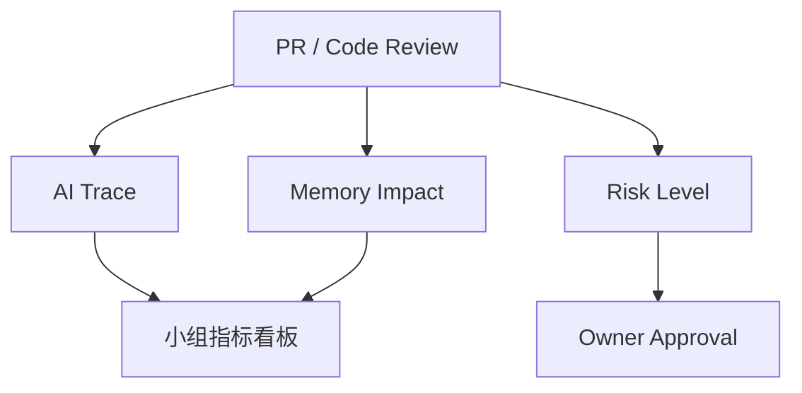

## 14. Phase 4：部门级平台化

时间：第 6-12 个月。

目标：

- 将小组经验产品化为部门级机制。
- 引入 Hook Gateway、Memory Registry、Policy Engine 的轻量版本。

动作：

| 能力 | 说明 |
|---|---|
| Team Hook Gateway | 统一接收 PR / CI / release 事件 |
| Memory Registry | 多项目共享 Memory |
| Policy Engine | 自动判断高风险路径和审批要求 |
| Agent 分工 | Planner / Builder / Tester / Reviewer / Security 分工 |
| 审计存储 | Trace 统一保存 |

平台图：

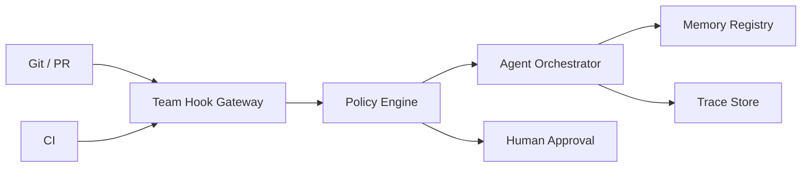

## 15. Phase 5：企业级推广

时间：12 个月以后，或部门级试点证明有效后。

目标：

- 接入企业安全、合规、采购和平台体系。
- 形成可跨团队复用的 AI 开发治理能力。

动作：

| 能力 | 说明 |
|---|---|
| 模型供应商治理 | approved model matrix、数据出境、保留周期 |
| 权限执行 | 工具 allowlist、路径 sandbox、JIT approval |
| 安全审计 | SIEM / DLP / Secrets Manager 集成 |
| 培训认证 | AI Contributor / Reviewer / Owner |
| ROI 看板 | 成本、效率、质量、风险四类指标 |

企业级目标架构：

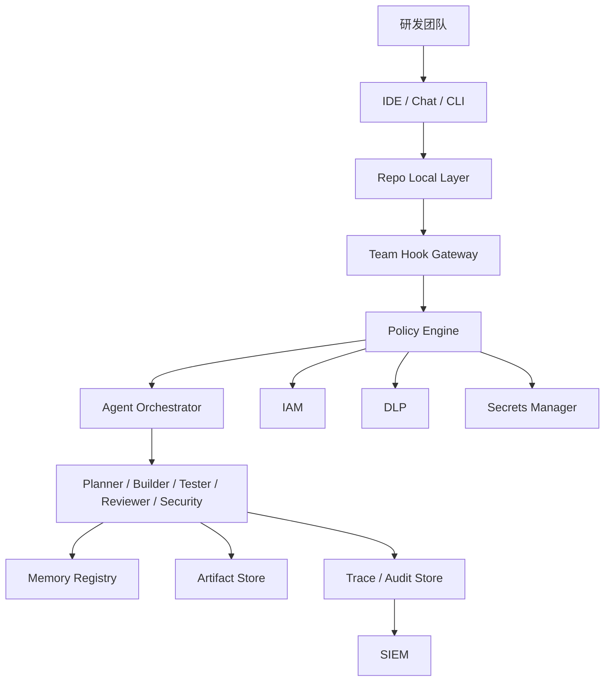

## 16. 初期方案和后续方案的关系

初期方案不是完整蓝图的缩小版，而是验证蓝图是否值得推进的实验。

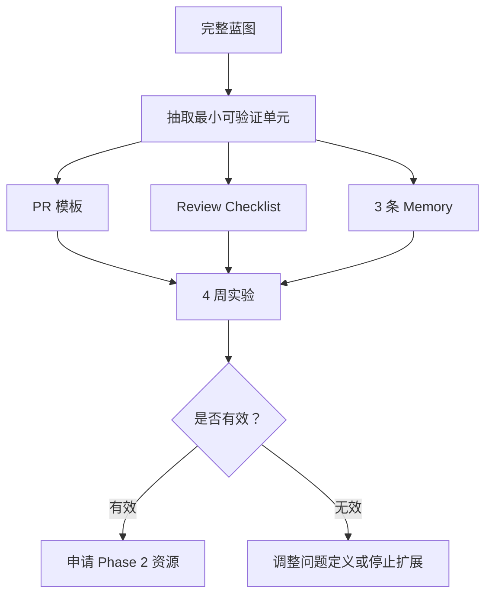

## 17. 资源申请建议

Phase 1 不建议申请平台资源。只申请：

```text
1. 上级认可 4 周试点。
2. 小组统一使用新 PR 模板。
3. reviewer 接受 5 条 AI Review Checklist。
4. 允许你每周花 30-45 分钟做抽样分类。
5. 4 周后安排一次 30 分钟复盘。
```

Phase 2 才申请：

- 轻量 Hook。
- 指标看板。
- Memory 维护时间。

Phase 3 以后再申请：

- 平台能力。
- 跨团队推广。
- 安全和合规接入。

## 18. 风险和应对

| 风险 | 表现 | 应对 |
|---|---|---|
| 方案显得太重 | 上级觉得 10 人小组没必要 | 只申请 4 周实验，不申请平台 |
| reviewer 不愿多填东西 | checklist 被忽略 | checklist 只保留 5 条，不要求分类 |
| 数据采集坚持不下来 | 没有 before / after | 由你每周抽样，不依赖全组 |
| 指标不明显 | 4 周后看不出改善 | 输出定性案例，调整再跑 2 周 |
| Memory 变成形式主义 | PR 只是空填 | 第一批只放 3 条真实高频问题 |

## 19. 推荐汇报话术

```text
我们现在不是要建设完整 AI 治理平台。

当前问题是 AI 代码质量不稳定、review 负担变大、团队用法不统一。

我建议先做一个 4 周小组实验：
只加 PR 模板、5 条 review checklist 和 3 条团队 Memory。

我们用过去 2 周 PR 做 baseline，
未来 4 周看 review 轮次、缺陷类 comment 占比、同类问题重复次数是否下降。

如果有效，再考虑引入轻量 Hook 和团队级 Trace；
如果无效，就停止扩展，复盘原因。

这个实验成本很低，但能给后续是否立项提供数据依据。
```
